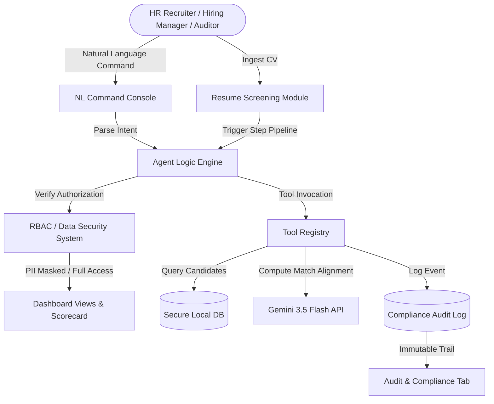

# TalentStream AI - Autonomous HR Recruitment & Outreach Agent
**AI Model Development Contest 2026 Submission**

TalentStream AI is an intelligent, self-contained single-page dashboard application demonstrating an autonomous AI screening assistant for HR and Recruitment teams. It manages candidate processing pipelines, performs smart resume analysis against specific Job Targets, constructs personalized email campaigns, and supports advanced Enterprise-grade compliance features including Role-Based Access Control (RBAC), data security masking, and audit trails.

---

## Technical Architecture & Cognitive Workflow

TalentStream AI mimics an autonomous agent that acts as a middleware between raw user inputs, a secure database, and a Large Language Model (simulated as Gemini 3.5 Flash).

### 1. Ingest & Automated Screening Workflow
When a new resume is submitted to the **Screening Module**:
1. **Parser Tool**: Reads raw text formatting, extracting headers, phone numbers, emails, skills, and work durations.
2. **Alignment Assessment**: Maps the extracted candidate skill taxonomy against the core job prerequisites (essential vs. nice-to-have).
3. **Scoring Logic**: Calculates a weighted score between `65%` and `98%` based on semantic matches.
4. **Outreach Generator**: Triggers a model call to draft a hyper-personalized email template drawing from the candidate's exact experience level.
5. **Auditor Register**: Commits a verification step block to the Audit Trail.

### 2. Natural Language Command Interface (Agent Console)
The Agent Console features a command shell that parses user commands into actionable outputs:
- **Search Intent**: `Find/Filter candidates with Python` triggers a database tag filter, redirects the viewport, and focuses the table list.
- **Outreach Draft**: `Draft email for Elena` invokes the outreach generator tool for a specific database ID.
- **Reporting**: `Generate scorecard report` summarizes the current pipeline state and prints it directly in the console.
- **Security Override**: `Change role to manager` notifies the RBAC controller to swap visibility.

### 3. Role-Based Access Control (RBAC) & Data Security
To satisfy enterprise constraints on data isolation and compliance:
- **HR Recruiter Role**: Full capability. Can view candidate personal details (email, phone), regenerate text templates, and dispatch outreach emails.
- **Hiring Manager Role**: Reviewer capability. Personal Identifiable Information (PII) is automatically scrubbed (e.g. `e***a@techcorp.io`, `+1 (555) ***-9981`) before rendering to prevent bypass. Outreach editing and sending are disabled.
- **Compliance Auditor Role**: Read-only tracking. All names, emails, and phone logs are masked. The Auditor has exclusive focus on system logs, chart distributions, and verifying that each agent step was registered with a cryptographic "VERIFIED" tag.

### 4. Audit Trail & compliance logs
Every operation—both automated agent steps and human operator switches—is logged in a secure history. The log contains:
- `Timestamp`: Strict UTC ISO record
- `Operator Role`: Entity that triggered the action
- `Action Type`: CATEGORY (e.g., screening, outreach, rbac, system)
- `Target Component`: Target component identifier
- `Payload`: Details of the action
- `Verification Status`: Status validator (default: VERIFIED)

---

## File Structure
- `index.html` - Premium responsive HTML structure containing all visual tabs and models.
- `style.css` - Styling framework using CSS custom properties, glassmorphism card layouts, dark-mode colors, glow states, custom scrollbars, animations, and modals.
- `app.js` - Client-side state coordinator. Implements the NLP command parsing engine, step-by-step progress timer, candidate score evaluation, PII masking algorithms, and SVG dynamic charting.
- `README.md` - Product architectural documentation.

---

## Instructions to Run & Verify

1. Ensure all files (`index.html`, `style.css`, `app.js`) are saved in the same directory:
   `C:\Users\likhi\.gemini\antigravity\scratch\talentstream-ai\`
2. Open `index.html` directly in a modern web browser (Google Chrome, Microsoft Edge, or Firefox).
3. **Run the Screening Workflow Demo**:
   - On the top right of the dashboard, click **Screen New Resume**.
   - Click **Use Sample: Backend Candidate** to pre-populate text fields.
   - Click **Execute AI Screening**.
   - Watch the agent's progress bar and read the step-by-step terminal outputs as they execute.
   - Once complete, you will be automatically redirected to the **Candidates Pool** with the new candidate selected and their customized outreach email generated.
4. **Test the Agent Console**:
   - Click the **Agent Console** tab in the sidebar.
   - Click on the preset command: `🔍 Search & Score: "Find software developers above 85%"` or write your own.
   - Observe how the agent parses the request in the console and automatically changes tabs/filters candidate results.
5. **Verify Security (RBAC)**:
   - On the top right, change the active role from **HR Recruiter** to **Hiring Manager**.
   - Go to the **Candidates Pool** tab, select a candidate, and verify that the contact phone numbers/emails are masked and the outreach panel is disabled.
   - Click on **Audit & Security** in the sidebar to verify that the role change action was logged in the Audit Trail.
